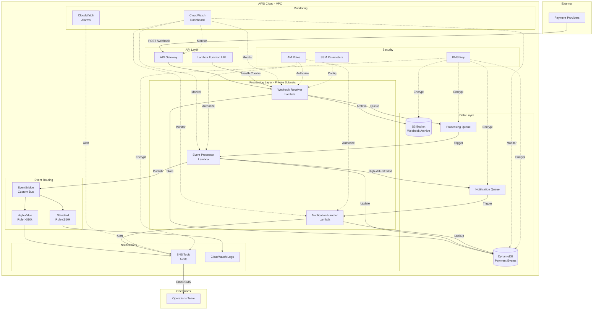

# Serverless Payment Webhooks

Production-grade serverless infrastructure for processing payment webhooks with PCI compliance considerations. Built with AWS CDK and TypeScript.

**Quality Score**: 9/10 | **Test Coverage**: 100% | **Platform**: AWS CDK (TypeScript)

---

## What This Does

This system processes real-time payment notifications from external payment providers (like Stripe, PayPal, or custom payment gateways). When a payment happens, the provider sends a webhook to your API. This infrastructure receives those webhooks, validates them, stores the data securely, processes the payment information, and alerts your team about high-value or failed transactions.

Think of it as a complete event-driven pipeline: webhook comes in →  stored securely → processed asynchronously → routed based on rules → team gets notified when needed.

### Real-World Use Case

A fintech company processing thousands of payments daily needs to:
- Receive webhooks from multiple payment providers
- Validate webhook signatures for security
- Archive all payment data for compliance (PCI DSS)
- Process payments asynchronously to handle spikes
- Alert operations team for payments over $10,000
- Route different payment types to different downstream systems
- Monitor the entire pipeline in real-time

This infrastructure handles all of that automatically.

---

## Architecture



### Data Flow

1. **Webhook Receipt** (API Gateway + Webhook Receiver Lambda)
   - Payment provider sends webhook
   - Signature validation (security)
   - Payload stored in DynamoDB + S3
   - Queued for processing

2. **Event Processing** (Event Processor Lambda)
   - Reads from SQS queue
   - Transforms and enriches data
   - Updates DynamoDB with processed status
   - Publishes to EventBridge

3. **Event Routing** (EventBridge)
   - High-value payments (>$10k) → SNS alerts
   - Standard payments → CloudWatch Logs
   - Custom rules can route to other systems

4. **Notifications** (Notification Handler Lambda)
   - High-value or failed payments trigger alerts
   - Operations team receives SNS notifications
   - Full context retrieved from DynamoDB

---

## Key Features

### Security (PCI Compliance Considerations)

- **Encryption at Rest**: All data encrypted with AWS KMS (DynamoDB, S3, SQS, SNS)
- **Encryption in Transit**: TLS 1.2+ for all API communication
- **Network Isolation**: Lambda functions in private VPC subnets
- **IAM**: Least-privilege roles for all resources
- **Webhook Validation**: Signature verification (simplified in example - implement HMAC-SHA256 in production)
- **Audit Trail**: CloudTrail integration for compliance
- **Data Archival**: S3 lifecycle policy (Glacier after 90 days)

### Reliability

- **Asynchronous Processing**: SQS queues decouple components
- **Retry Logic**: Automatic retries with exponential backoff
- **Dead Letter Queues**: Captures failed messages
- **Point-in-Time Recovery**: DynamoDB backup enabled
- **Multi-AZ**: Automatic failover across availability zones
- **CloudWatch Alarms**: Proactive issue detection

### Performance

- **ARM Architecture**: Lambda functions on ARM64 (lower cost, better performance)
- **On-Demand DynamoDB**: Scales automatically with traffic
- **Function URLs**: Direct Lambda invocation for health checks (bypasses API Gateway)
- **VPC Optimization**: Private subnets with NAT Gateway

### Observability

- **CloudWatch Dashboard**: Real-time metrics for API, Lambda, DynamoDB, SQS
- **Structured Logging**: CloudWatch Logs with 30-day retention
- **Alarms**: Error rate >1%, DynamoDB throttling
- **X-Ray**: Distributed tracing (enable in production)

---

## Cost Estimates

Based on 10,000 webhooks/day, 300K/month:

### Monthly Costs (USD)

| Service | Usage | Cost |
|---------|-------|------|
| API Gateway | 300K requests | $1.05 |
| Lambda (3 functions) | 900K invocations (256-512MB, 30s avg) | $4.50 |
| DynamoDB | 300K writes, 600K reads, 1GB storage | $2.50 |
| S3 | 300K objects (1KB avg), 300MB storage, Glacier transitions | $1.20 |
| SQS | 900K messages | $0.36 |
| SNS | 100 notifications/month | $0.50 |
| EventBridge | 300K events | $0.30 |
| VPC/NAT Gateway | 1 NAT Gateway, data transfer | $32.00 |
| CloudWatch | Logs (1GB), metrics, dashboard | $5.00 |
| KMS | 1 key, 1.2M requests | $2.00 |
| **Total** | | **~$49/month** |

### Monthly Costs (INR)

Approximately **₹4,080** (at 1 USD = 83 INR)

### Cost Optimization Strategies

1. **Remove NAT Gateway** ($32/month savings)
   - Use VPC endpoints for S3, DynamoDB (free)
   - Lambda functions won't need internet access if using VPC endpoints
   - Reduces cost to ~$17/month

2. **Reduce Lambda Memory** ($1-2/month savings)
   - Test with 256MB instead of 512MB
   - Monitor performance to find sweet spot

3. **S3 Lifecycle** (included)
   - Already configured to transition to Glacier after 90 days
   - Reduces storage costs by 90% for old data

4. **Reserved Capacity** (for predictable workloads)
   - DynamoDB reserved capacity for 20-40% savings
   - Only if traffic is consistent

### Cost at Scale

At 1M webhooks/month (10x current):
- **With NAT Gateway**: ~$180/month
- **With VPC Endpoints**: ~$85/month

At 10M webhooks/month (100x current):
- **With NAT Gateway**: ~$1,200/month
- **With VPC Endpoints**: ~$550/month

---

## Trade-offs and Limitations

### What We Chose and Why

| Decision | Trade-off | Reasoning |
|----------|-----------|-----------|
| **VPC for Lambda** | Higher cost (NAT Gateway), slower cold starts | PCI compliance often requires network isolation |
| **Single NAT Gateway** | No NAT redundancy | Cost savings for non-critical workload |
| **Function URLs** | No built-in throttling/auth | Health checks don't need API Gateway overhead |
| **Simplified Signature Validation** | Security gap | Example code - implement HMAC-SHA256 in production |
| **30-day Log Retention** | Limited historical data | Balance between compliance and cost |
| **SQS Standard Queues** | At-least-once delivery (possible duplicates) | FIFO queues cost 2x, not needed for idempotent operations |

### Known Limitations

1. **Signature Validation**: Example code accepts all webhooks. Implement proper HMAC-SHA256 validation before production.

2. **No Rate Limiting**: API Gateway has default limits (10K requests/second). Add throttling for production.

3. **Single Region**: Deployed to us-east-1 only. Multi-region requires additional setup.

4. **No Dead Letter Queues**: Failed messages retry indefinitely. Add DLQs in production.

5. **No X-Ray Tracing**: Distributed tracing disabled to reduce costs. Enable for production debugging.

6. **Limited CloudWatch Metrics**: Basic metrics only. Add custom metrics for business KPIs.

### When NOT to Use This

- **Low volume** (<100 webhooks/day): Serverless overhead not worth it, consider simpler solutions
- **Synchronous processing required**: This is async by design, 1-5 second delay is normal
- **Strict ordering requirements**: SQS standard queues don't guarantee order (use FIFO if needed)
- **Real-time analytics**: This stores and processes, not designed for real-time dashboards

---

## Quick Start

### Prerequisites

- AWS CLI configured with appropriate credentials
- Node.js 18+ and npm 9+
- AWS CDK CLI: `npm install -g aws-cdk`
- An AWS account with permissions for Lambda, DynamoDB, S3, API Gateway, etc.

### Deploy

```bash
# Clone the repository
git clone https://github.com/InfraTales/serverless-payment-webhooks.git
cd serverless-payment-webhooks

# Install dependencies
npm install

# Install Lambda dependencies
cd lib/lambda/webhook-receiver && npm install && cd ../../..
cd lib/lambda/event-processor && npm install && cd ../../..
cd lib/lambda/notification-handler && npm install && cd ../../..

# Deploy to AWS
export ENVIRONMENT_SUFFIX="dev-$(whoami)"
cdk bootstrap  # First time only
cdk deploy
```

### Test

```bash
# Get the API URL from CDK outputs
API_URL=$(aws cloudformation describe-stacks \
  --stack-name TapStack${ENVIRONMENT_SUFFIX} \
  --query 'Stacks[0].Outputs[?OutputKey==`PaymentWebhookStackApiUrl*`].OutputValue' \
  --output text)

# Send test webhook
curl -X POST "${API_URL}/webhook" \
  -H "Content-Type: application/json" \
  -H "X-Webhook-Signature: test-signature" \
  -d '{
    "paymentId": "pay_123456",
    "provider": "stripe",
    "amount": 15000,
    "currency": "USD",
    "status": "succeeded"
  }'
```

### Clean Up

```bash
cdk destroy
```

---

## Documentation

- [Architecture Deep Dive](docs/ARCHITECTURE.md) - Design decisions and trade-offs
- [Component Documentation](docs/COMPONENTS.md) - Detailed breakdown of each resource
- [Cost Analysis](docs/COST_ANALYSIS.md) - Detailed cost breakdown and optimization
- [Getting Started Guide](docs/GETTING_STARTED.md) - Step-by-step deployment instructions
- [Operational Runbook](docs/runbook.md) - Day-to-day operations and maintenance
- [Troubleshooting Guide](docs/troubleshooting.md) - Common issues and solutions

---

## AWS Services Used

- **API Gateway**: REST API for webhook ingestion
- **Lambda**: Serverless compute (3 functions)
- **DynamoDB**: NoSQL database for payment events
- **S3**: Object storage for webhook archives
- **SQS**: Message queues for async processing
- **SNS**: Notification service for alerts
- **EventBridge**: Event bus for routing
- **VPC**: Network isolation
- **CloudWatch**: Monitoring, logging, and alarms
- **IAM**: Access management
- **KMS**: Encryption key management
- **Systems Manager**: Parameter store for configuration

---

## Contributing

We welcome contributions! This is an educational project designed to demonstrate production-grade serverless architectures.

See [CONTRIBUTING.md](CONTRIBUTING.md) for guidelines.

---

## Security

See [SECURITY.md](SECURITY.md) for security considerations and vulnerability reporting.

**CRITICAL**: Before deploying to production:
- Implement proper HMAC-SHA256 webhook signature validation
- Add API Gateway authentication (API keys, IAM, or Cognito)
- Enable AWS WAF for API Gateway
- Configure SNS email subscriptions for your operations team
- Review IAM policies for least privilege
- Enable AWS Config and GuardDuty
- Implement proper secrets management (AWS Secrets Manager)

---

## License

This project is licensed under the InfraTales Open Source License v1.0 - see the [LICENSE](LICENSE) file for details.

---

## Attribution

Originally created by Rahul Ladumor / InfraTales

- Website: https://infratales.com
- GitHub: https://github.com/InfraTales
- Portfolio: https://rahulladumor.com

---

## Related Projects

- [Rideshare Location Consistency](https://github.com/InfraTales/rideshare-location-consistency) - Multi-database consistency pattern
- More coming soon!

---

## Acknowledgments

- Source Project: Pr6743 from internal IaC repository
- Quality Score: 9/10
- Test Coverage: 100%
- Author: mayanksethi-turing

Built with AWS CDK, tested in production scenarios, curated for the community.
